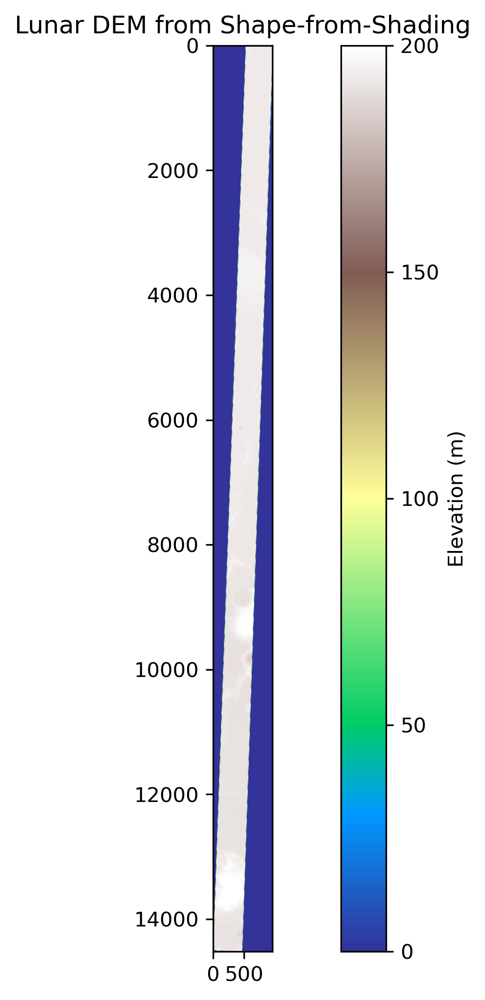
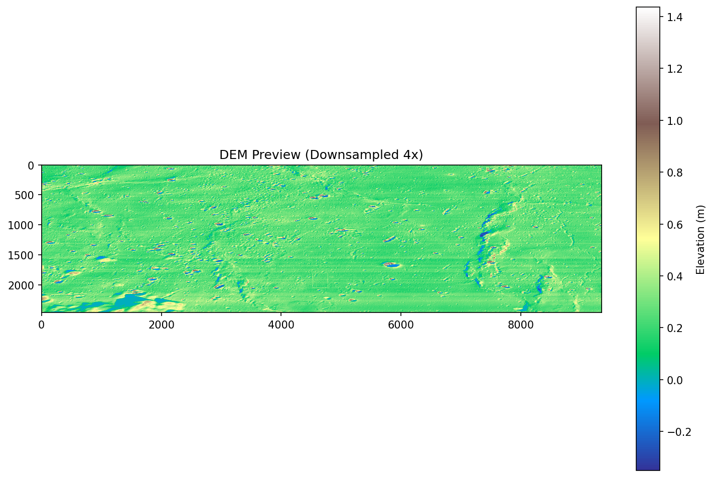
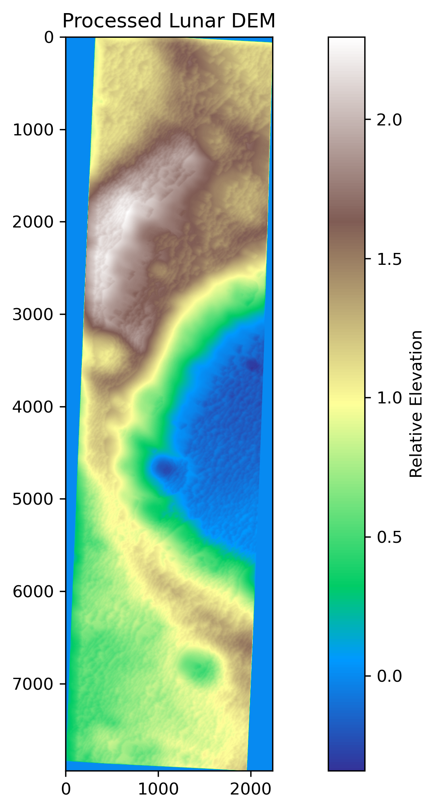

# Lunar DEM Generator & Viewer

A Python toolkit for generating and visualizing lunar Digital Elevation Models (DEMs) from satellite imagery using Shape-from-Shading (SfS) techniques.

---

## Overview

This project processes georeferenced lunar imagery (e.g., from Chandrayaan-2 TMC) to reconstruct 3D terrain elevation data. It uses a photometric model tuned for the Moon's reflectance properties and provides an interactive 3D viewer for the resulting DEMs.



---

## Features

- Shape-from-Shading (SfS) elevation reconstruction from single lunar images
- Lunar-specific Hapke-inspired reflectance model
- Optional LOLA reference DEM integration for absolute elevation calibration
- Exports georeferenced GeoTIFF DEMs
- Interactive 3D viewer with vertical exaggeration and colormap controls

---

## Visualization Examples





---

## Requirements

```
numpy
rasterio
scipy
scikit-image
matplotlib
tqdm
pyvista
PyQt5
```

Install with:

```bash
pip install numpy rasterio scipy scikit-image matplotlib tqdm pyvista PyQt5
```

---

## Usage

### Generate a DEM

Edit the configuration block in `generate_sfs_dem.py`:

```python
INPUT_IMAGE = "path/to/your/image.tif"   # Must be georeferenced
LOLA_REFERENCE = ""                        # Optional reference DEM
OUTPUT_PREFIX = "path/to/output/lunar_sfs"

SUN_AZIMUTH = 240.5    # degrees, from image metadata
SUN_ELEVATION = 40.5   # degrees, from image metadata
```

Then run:

```bash
python generate_sfs_dem.py
```

Output files:
- `<OUTPUT_PREFIX>_dem.tif` — georeferenced elevation raster
- `<OUTPUT_PREFIX>_visualization.png` — terrain colormap preview

### View a DEM in 3D

```bash
python lunar_dem_viewer.py
```

Load any GeoTIFF DEM and explore it interactively with adjustable vertical exaggeration and colormaps (terrain, viridis, plasma, gray, hot, or a custom lunar grayscale).

---

## Input Requirements

- Input image must be a **georeferenced GeoTIFF** (EPSG or projected CRS)
- Sun azimuth and elevation angles should come from the image acquisition metadata
- LOLA reference DEM is optional but improves absolute elevation accuracy

---

## Project Structure

```
├── generate_sfs_dem.py    # SfS DEM generation pipeline
├── lunar_dem_viewer.py    # PyQt5 + PyVista 3D viewer
└── README.md
```
